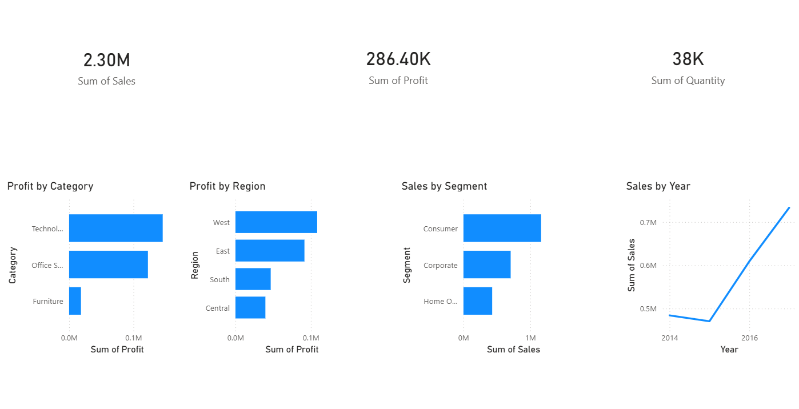

## Overview
This project analyzes Superstore sales data to identify key business insights on products, regions, customer segments, and sales trends.

## Business Questions
- Which product category generates the most profit?
- Which region performs best?
- Which customer segment should be targeted?
- How has sales grown over the years?

## Tools Used
- Python (pandas, matplotlib, seaborn)
- Power BI

## Key Insights
- **Technology** is the most profitable category ($145,454)
- **Furniture** has the lowest profit ($18,451) — pricing strategy should be reviewed
- **West** region leads in profit ($108,418)
- **Consumer** segment drives the highest sales ($1.16M)
- Sales show consistent growth from 2014 to 2017

## Dashboard

## Project Structure
sales-data-analysis/
├── dashboard/
│   ├── dashboard_screenshot.png
│   └── sales_dashboard.pbix
├── data/
│   ├── Superstore.csv
│   └── superstore_cleaned.csv
├── notebooks/
│   └── 01_eda_cleaning.ipynb
└── README.md